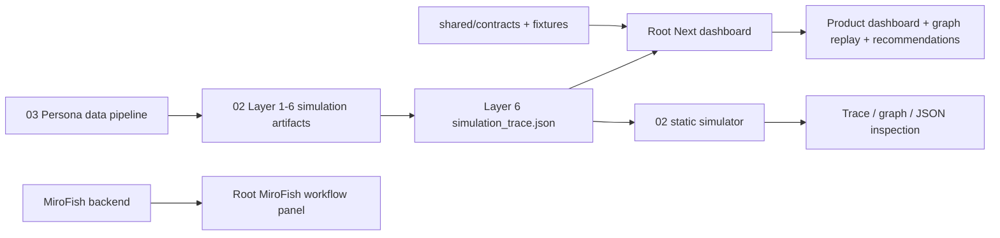

# SEA Codex

SEA Codex is a Shopee-style market simulation workspace. It combines a product-listing dashboard, a social contagion simulation engine, persona data preparation, MiroFish swarm workflow hooks, and analyst/API contracts for answering questions like: "If we change this ad, listing, shipment promise, or trust signal, which buyer groups react, spread it, resist it, or churn?"

Core demo line:

> Traditional synthetic persona tools ask people what they think. SEA Codex simulates what happens after those people talk to each other.

## What Runs Today

- The repo root is the primary frontend: a Next.js dashboard that loads the latest Layer 6 simulation trace when available, falls back to shared fixtures, and renders product controls, graph replay, timeline chatter, demographic sales projections, listing recommendations, and the MiroFish workflow panel.
- `02-simulation-engine/` is the static trace-inspection and simulation mock: upload ads/proposals, run a deterministic swarm, inspect graph networks, see the full tick trace, and view raw JSON contract output.
- `02-simulation-engine/market_analysis_layer*_*/` contains generated Layer 1-6 artifacts, including the full Layer 6 ground-truth `simulation_trace.json`.
- `03-persona-data-pipeline/`, `04-analyst-api/`, and `shared/` are integration lanes and contract boundaries. Some backend pieces are scaffolds, so the frontend is designed to keep working offline from local traces and fixtures.

## Repository Map

| Path | Role |
| --- | --- |
| `app/` | Root Next.js app router. `app/page.tsx` is the integrated command-center UI. |
| `components/` | React dashboard modules: product listing controls, Cytoscape graph replay, metrics, demographic reports, recommendations, chatter timeline, and `MiroFishWorkflow`. |
| `lib/` | Frontend data/model logic: product model, Singapore segment projections, demo trace building, and Layer 6 trace normalization. |
| `fixtures/` | App-local fixture data for the root dashboard. |
| `shared/contracts/` | JSON schemas shared across lanes: personas, simulation traces, and analyst summaries. Treat these as integration boundaries. |
| `shared/fixtures/` | Cross-lane fallback fixtures, especially `golden_trace.json`. |
| `01-dashboard-demo/` | Legacy dashboard docs and pitch-deck artifacts. The runnable dashboard now lives at the repo root. |
| `02-simulation-engine/` | Static simulator UI plus Python preparation scripts and generated market-analysis artifacts. |
| `02-simulation-engine/mirofish/` | Bundled MiroFish upstream/vendor scaffold with Vue frontend and Python backend services. The root app includes a lightweight React workflow panel that can call this backend. |
| `03-persona-data-pipeline/` | Persona seed/data-prep lane for producing persona inputs compatible with `shared/contracts/persona.schema.json`. |
| `04-analyst-api/` | Analyst API lane for future backend endpoints and OpenAI-backed summaries. |
| `scripts/` | Local orchestration helpers, including `dev-all.ps1` for launching multiple surfaces. |
| `agent_guide/` | Agent-facing organization and integration guidance. |
| `RUNBOOK.md` | Operational runbook, known gaps, and integration notes. |

## Architecture



## Quick Start

Install root frontend dependencies:

```powershell
npm ci
```

Run the primary dashboard:

```powershell
npm run dev -- --port 3000
```

Open:

```text
http://localhost:3000
```

Run the static 02 simulator:

```powershell
python -m http.server 3100 --directory 02-simulation-engine
```

Open:

```text
http://localhost:3100/index.html
```

Launch the main frontend, static simulator, and analyst API window when available:

```powershell
powershell -ExecutionPolicy Bypass -File scripts/dev-all.ps1
```

Regenerate Layer 1-6 artifacts with visible command windows:

```powershell
powershell -ExecutionPolicy Bypass -File 02-simulation-engine/run_layers_visible.ps1
```

## Optional MiroFish Workflow

The root dashboard includes `components/MiroFishWorkflow.tsx`, a React panel that calls a MiroFish-compatible API. By default it targets:

```text
http://localhost:5001
```

Override it with:

```powershell
$env:NEXT_PUBLIC_MIROFISH_API_URL="http://localhost:5001"
npm run dev -- --port 3000
```

The bundled MiroFish reference stack lives in `02-simulation-engine/mirofish/`. Treat it as vendor/reference code unless actively integrating upstream MiroFish behavior.

## Development Notes

- Root Next is the canonical product frontend.
- `02-simulation-engine/index.html` is kept as a focused static simulator and trace inspector.
- Keep shared schemas stable before changing producers or consumers.
- Prefer adapting traces through `lib/simulationTraceAdapter.ts` instead of adding one-off parsers in components.
- Avoid committing local caches, logs, screenshots, `node_modules`, or generated scratch folders.

## Verification

Useful checks before pushing:

```powershell
npm run build
```

```powershell
npm run typecheck
```

The current frontend can run without live scraping, live MiroFish, or a deployed analyst API because it uses Layer 6 and shared fixture fallbacks.
